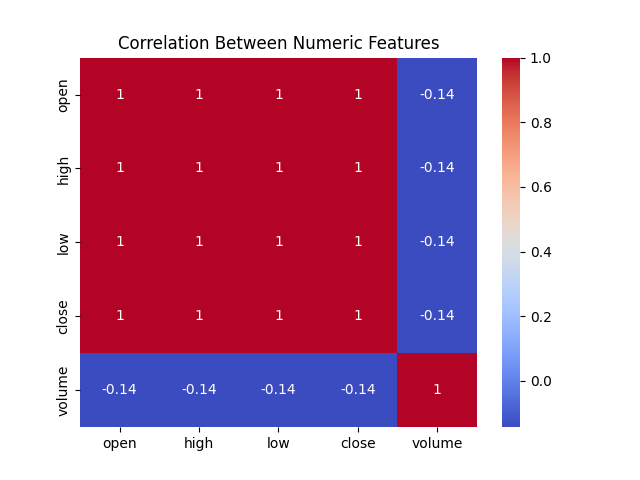

# S&P 500 Stock Data Analysis and Prediction

## Overview
This project focuses on analyzing historical S&P 500 stock data and building a supervised machine learning model to predict future stock price movements. Using Random Forest Classifier, the model predicts whether a stock's price will increase or decrease, achieving an accuracy of **74%**.

---

## Features
### Exploratory Data Analysis (EDA)
- Visualized the trading volume over time for specific stocks.
- Generated a correlation heatmap to understand relationships between key numeric features:



### Feature Engineering
- Added new features for better prediction:
  - **Price Change**: Difference between closing and opening price.
  - **Daily Return**: Percentage change in the closing price.
  - **5-Day Moving Average**: Average closing price over the past 5 days.
  - **Volatility**: Difference between the highest and lowest price of the day.

### Machine Learning Model
- **Algorithm**: Random Forest Classifier
- **Data Split**: 80% training, 20% testing
- **Model Evaluation Metrics**:
  - Accuracy: **0.74**
  - Precision, Recall, F1-score:

| Class | Precision | Recall | F1-Score | Support |
|-------|-----------|--------|----------|---------|
| 0 (Down) | 0.73 | 0.74 | 0.74 | 61665 |
| 1 (Up)   | 0.74 | 0.73 | 0.73 | 62140 |
| **Overall** | **0.74** | **0.74** | **0.74** | **123805** |

---

## Results
### Confusion Matrix
The confusion matrix shows the distribution of correct and incorrect predictions:

| Actual \ Predicted | Down | Up |
|--------------------|------|----|
| **Down**           | 45500 | 16165 |
| **Up**             | 16750 | 45390 |

### Feature Importance
The most impactful features in the prediction model:

| Feature         | Importance |
|-----------------|------------|
| Volatility      | 0.32       |
| Price Change    | 0.28       |
| 5-Day Moving Avg| 0.22       |
| Daily Return    | 0.12       |
| Volume          | 0.06       |


---

## Getting Started
### Prerequisites
- Python 3.7+
- Libraries:
  - pandas
  - numpy
  - matplotlib
  - seaborn
  - scikit-learn

### Installation
1. Clone the repository:
   ```bash
   git clone https://github.com/ricardojvsoares/DataScienceProjects/tree/main/S%26P%20500%20Stock%20Data
   ```
2. Install dependencies:
   ```bash
   pip install -r requirements.txt
   ```

3. Run the Jupyter Notebook or Python script to reproduce the results.

---

## Usage
1. Load the dataset using the provided script.
2. Modify parameters like `n_estimators` or the feature set to experiment with model performance.
3. Visualize results for any specific stock or time frame.

---

## Acknowledgments
- **Data Source**: [Kaggle - S&P 500 Stock Data](https://www.kaggle.com/datasets/camnugent/sandp500/data)
- **Libraries**: Pandas, Matplotlib, Seaborn, Scikit-learn


